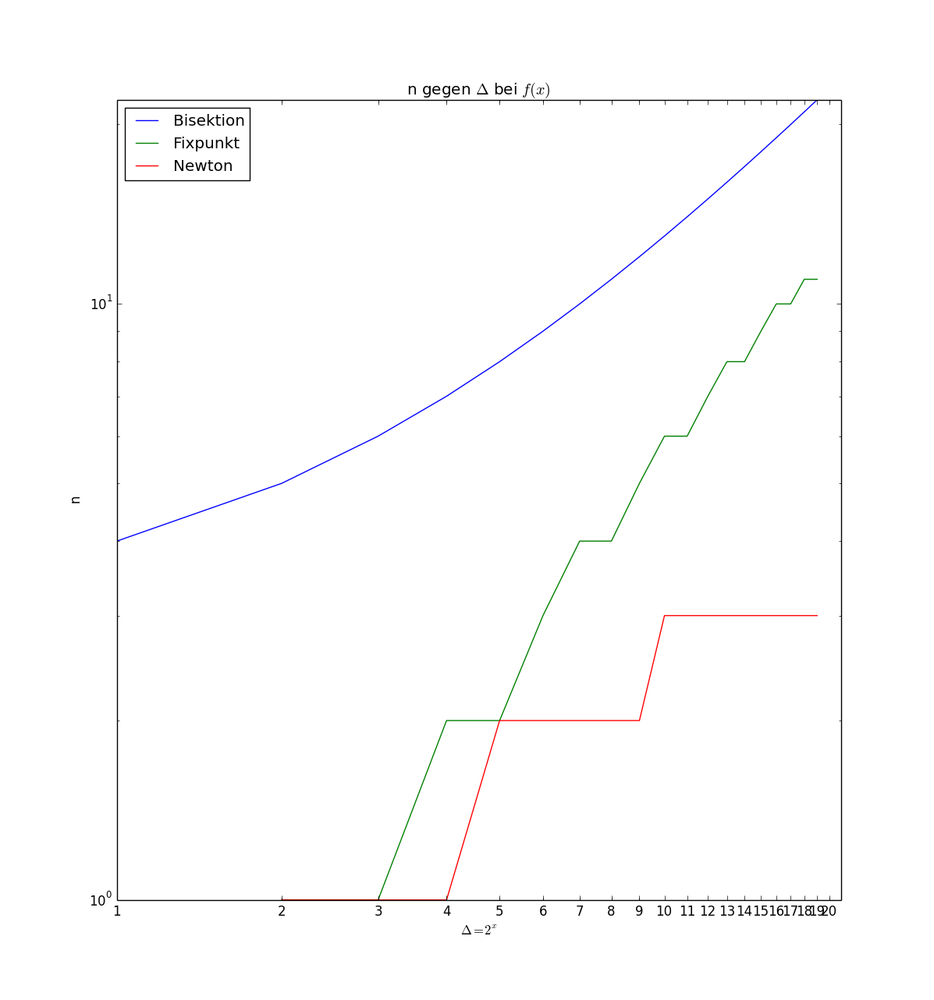

% Übungsblatt 2 - Computerphysik
% Carlos Martín Nieto; Tu Tran

# Aufgabe 2.1

Erstens ist die Funktion $\sin(x)$ an sich ungenau. Desweiteren wird dieses Ergebnis (was als Fließkommazahl gespeichert wird) mit sich multipliziert und dann von eins abgezogen, wodurch mehr Rundungsfehler auftreten können.

Je größer eine Zahl ist (betragsmäßig), desto weniger genauigkeit können wir erreichen. Das heißt, für Werte in der Nähe von $x = k\frac{\pi}{2}$, wo $\sin(x) \approx 1$ ist, werden die Fehler am größten sein.

Wir wissen, dass $\cos^2(x) + \sin^2(x) = 1$, also $\cos^2(x) = 1 - \sin^2(x)$. Ersetzen wir $f(x)$ durch $\cos^2(x)$, so ersparen wir uns die oben genannte Fehler.

# Aufgabe 2.3

## 2.3.2

\

## 2.3.3

Wie wir aus der Vorlesung wissen, eine Funktion $h(x)$ verhält sich besser beim Fixpunktverfahren, je kleiner $h'(\overline{x})$ ist, wobei $\overline{x}$ der Fixpunkt ist.

Wir berechnen der Fixpunkt beider Funktionen und finden heraus, dass der Fixpunkt von $f(x)$ ist $0.747652$ und der von $g(x)$ ist $-0.17082$. Also:

\begin{align*}
f(0.747652) &= -0.9971518\\
g(-0.17082) &= -0.34164 
\end{align*}

Davon ist klar zu sehen, dass der Fixpunkt von $g(x)$ deutlich kleiner ist als der von $f(x)$ und so verhält sich $g(x)$ besser bei der Fixpunktiteration.
